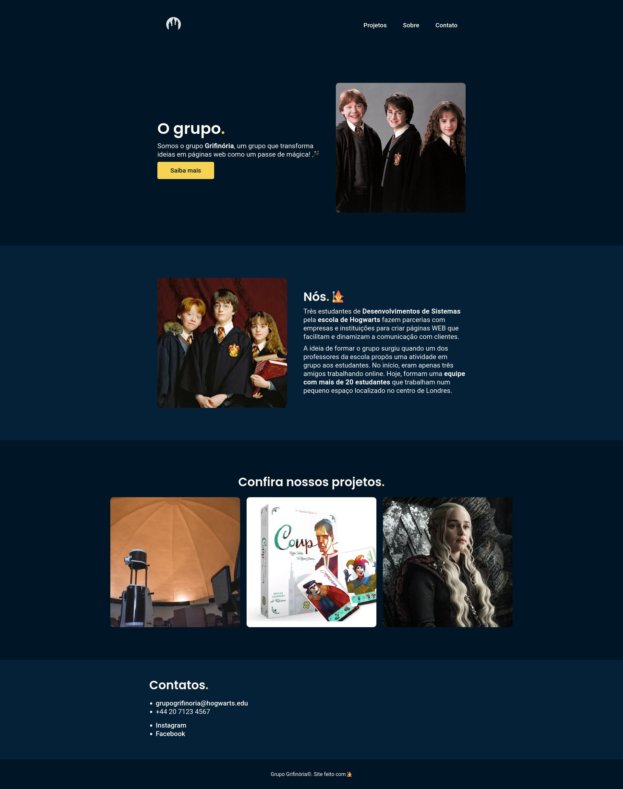
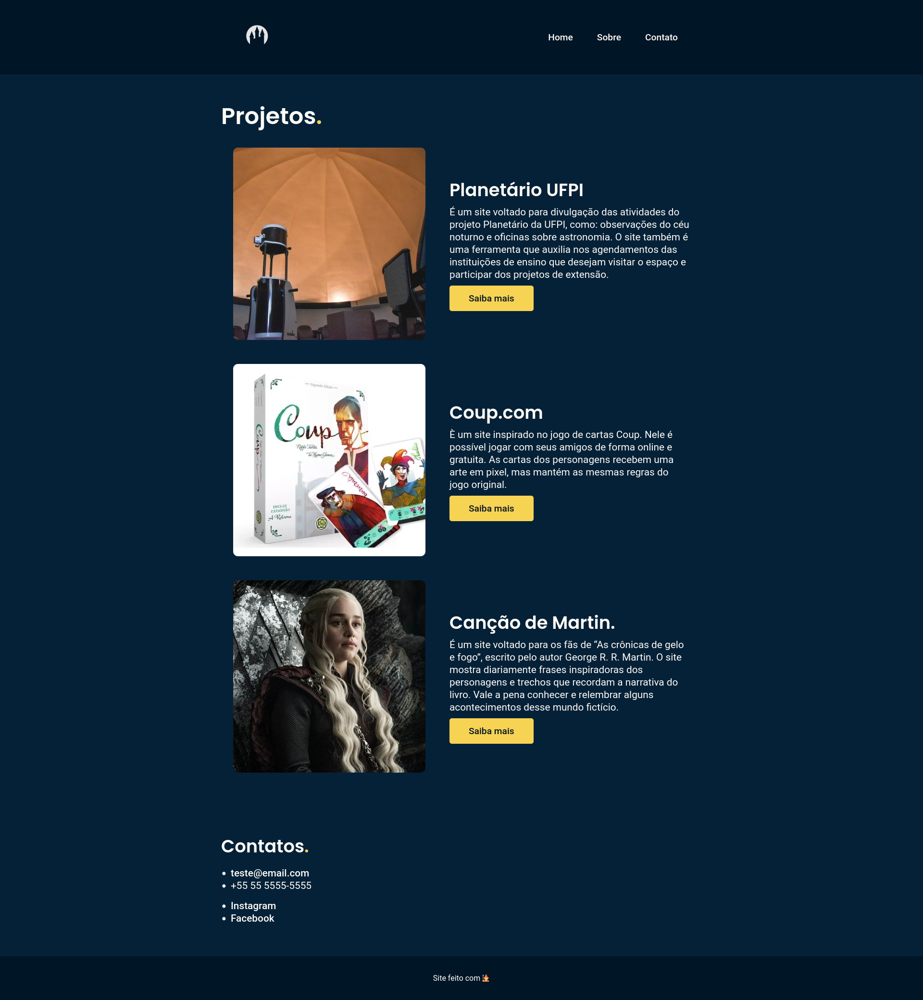

# projeto-portfolio

Projeto portfolio para a disciplina de IAW no IFPI.

## Demonstração

Página Inicial

Página projetos

## Links

- Teste o site [aqui](https://murilomonte.github.io/projeto-portfolio/)

## Feito por

- Murilo Monte
- Tiago Silva
- Victor Gabriel
